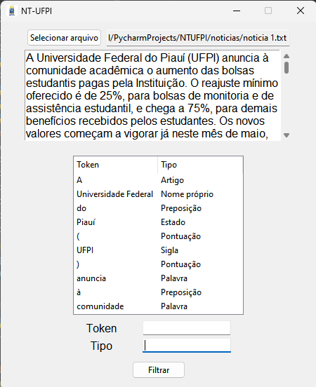

# NTUFPI

Analisador léxico que extrai tokens de notícias presentes no site da UFPI. Desenvolvido com [Daniel Lima](https://github.com/DanielLS2000) e [Ingrid Miranda](https://github.com/ingridm011) para a disciplina de Compiladores. A GUI foi desenvolvida com Tkinter e o lexer através do ANTLR.

# Imagens

